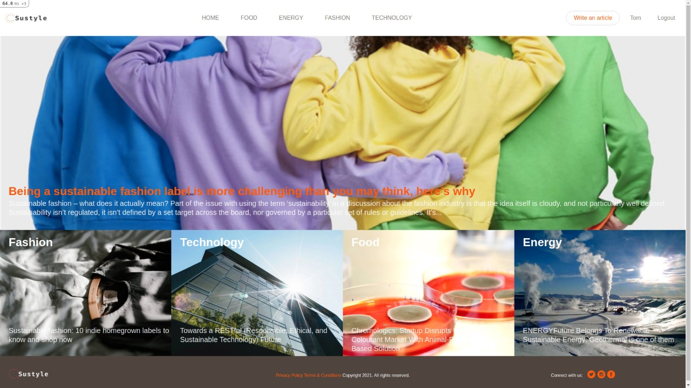
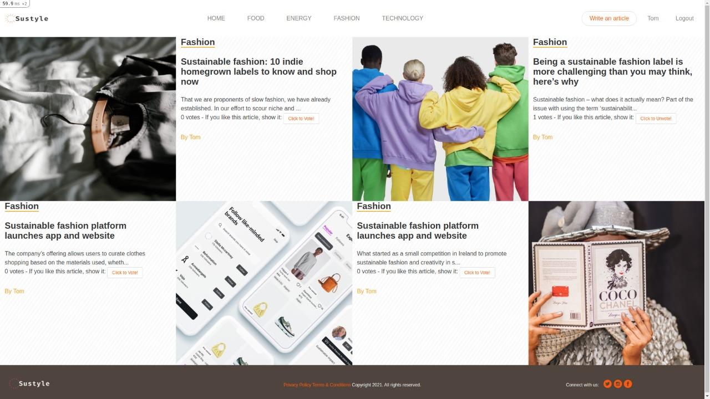

# Private Events

This is Sustyle, the website focused on the latest sustainability articles. Articles are separated into four main categories. This web page allows the registration of new users and authenticates them, users can create articles and assign them a category, they can also vote for the articles they like the most.

This site has been created mainly with Ruby on Rails as a framework and PostgreSQL database.



## Live Demo

<a href="https://murmuring-wildwood-50583.herokuapp.com/">Visit Page</a>

## Video Presentation

<a href="https://murmuring-wildwood-50583.herokuapp.com/">Video</a>

## Built With

- Ruby 2.7.2
- Ruby on Rails 6.1.1
- PostgreSQL
- Sqlite
- Rspec gem
- Simple_form gem
- Devise gem
- Shrine gem
- Bullet gem
- Bulma 

### Setup

To run this project locally, please ensure you have Ruby and Ruby on Rails installed on your machine, then clone this repository by running.

```bash
git clone https://github.com/mricanho/members-only
```
Open your terminal and CD to the directory where you create the clone repository.

Now run:

```bash
bundle install
```
To setup the database run:

```bash
rails db:create
rails db:migrate
```
Is super important to populate the app, so now run:
```bash
rails db:seed
```
To set up the server put:
```bash
rails s
```
After this you can open your favorite web-browser and copy paste the next:

```bash
http://localhost:3000
```
### Author

👤 *Miguel Ricaño*

- Github: [@mricanho](https://github.com/mricanho)
- Linkedin: [Miguel Ricaño](https://www.linkedin.com/in/mricanho/)

## Show your support

Give a ⭐️ if you like this project!

## Acknowledgments

- Microverse
- The Odin Project

## 📝 License

This project is [MIT](LICENSE) licensed.